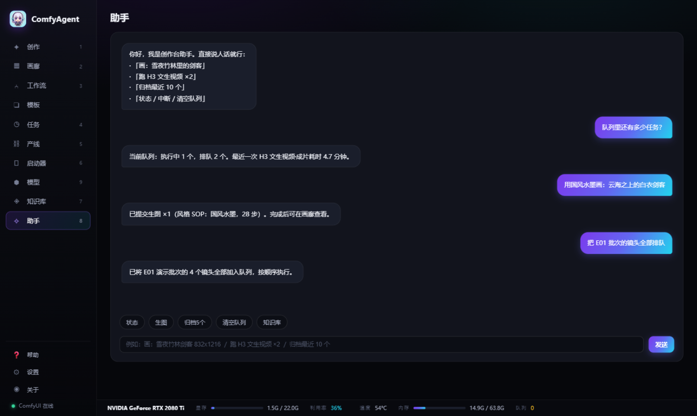
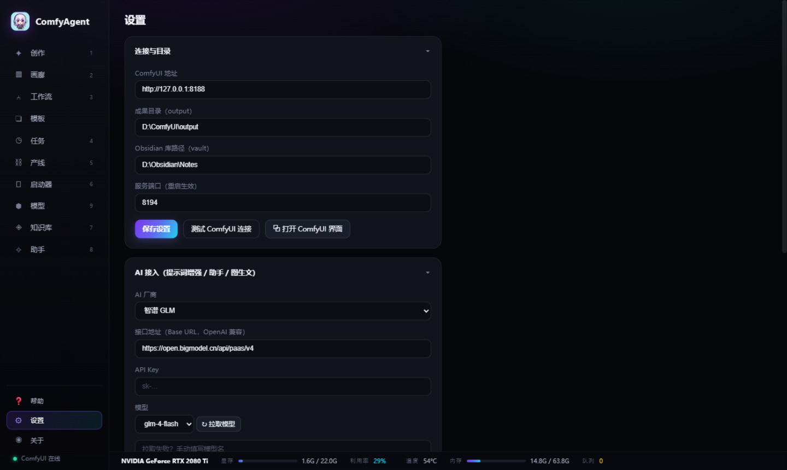

# ComfyAgent · AI 创作台

本地优先的 AI 创作台：一个原生窗口管理你的 ComfyUI —— 中文提示词生图/生视频、成果画廊、可视化工作流、600+ 模板库、任务队列、产线批次、Obsidian 知识库、硬件监控。


| | |
|---|---|
|  |  |
|  |  |
|  |  |
|  |  |

## 为什么是它

- **桌面产品**：双击 exe = 原生窗口 + 系统托盘，关窗最小化、再点托盘唤回；单实例；无控制台黑框
- **本地优先**：生成全程在你的显卡上，数据不出机器
- **零依赖技术栈**：纯 Python 标准库后端 + 原生 JS 前端，发布包仅 ~10MB

## 功能

- ✦ **创作**：中文输入自动增强为英文提示词（GLM 精修，MyMemory 兜底）→ Flux 生图 / H3 W4A8 生视频（640×352·5秒·4步·原生音频）；12 种风格 SOP、角色锁定串、图/视频双模式
- ▦ **画廊**：实时瀑布流、视频悬浮预览、批量归档/删除、PNG 内嵌参数解析、文件夹筛选
- ❏ **模板库**：ComfyUI 官方 602 模板（9 大分类），真实实例图预览，一键载入编辑器
- ⑃ **工作流**：SVG 节点可视化编辑（拖拽连线/网格吸附/节点校验）；内置 Flux + H3 双工作流；导入 UI/API JSON 或 PNG 提取
- ◷ **任务**：队列/进度/ETA/失败一键重试/GPU 耗时账本
- ⛓ **产线**：分集脚本解析→镜头清单→批量排队→逐镜状态→拼接成片（含 BGM 混音）
- ⏻ **启动器**：ComfyUI 启停/版本检查与一键更新/模型盘点/自定义节点/环境诊断/日志
- ◈ **知识库**：Obsidian 归档/统计/双链关系图/全库搜索预览
- ✧ **助手**：中文指令直达，支持多步动作序列
- 全局**硬件状态条**：GPU 利用率/温度/显存/内存/队列（nvidia-smi，2s 刷新）

## 安装使用

1. 下载/解压 `dist/ComfyAgent-win64.zip`
2. 双击 `ComfyAgent.exe` —— 原生窗口自动打开（首次有 30 秒设置向导）
3. 关窗最小化到托盘，托盘菜单可退出

前提：本机 ComfyUI（默认 127.0.0.1:8188）；ffmpeg 在 PATH（视频海报帧）；WebView2 运行时。

## 开发

```bash
python server.py --open   # 源码模式（浏览器打开）
python app.py             # 桌面壳模式
bash build_exe.sh         # 构建产品 exe
```

架构与迭代史见 [CHANGELOG.md](CHANGELOG.md)。

## 贡献

欢迎 Issue 与 PR（中英文均可）：

1. Fork 本仓库 → 新建分支 → 提交改动 → 发起 PR
2. 描述清楚「解决什么问题 / 怎么验证」即可
3. 改动涉及后端时请保持零第三方依赖原则（Python 标准库）

## License

[MIT](LICENSE) © 2026 IvenKooLab
