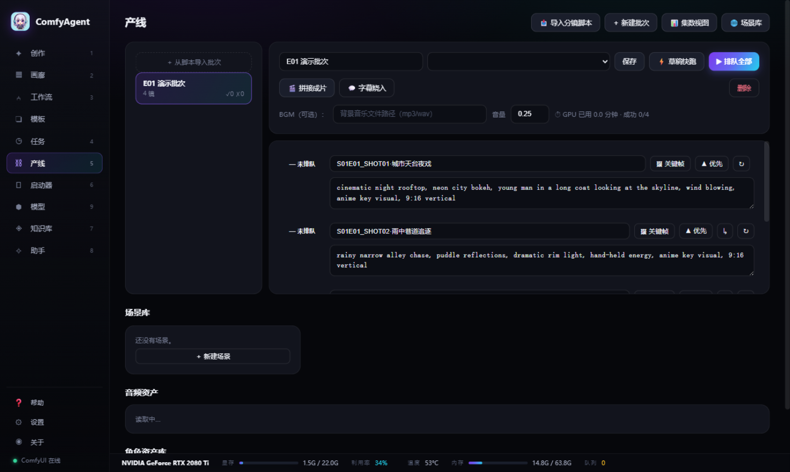
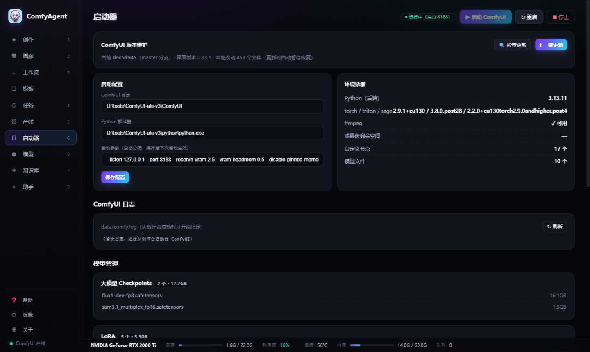
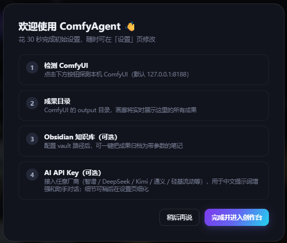

# ComfyAgent · AI 创作台

本地优先的 AI 创作桌面软件：一个原生窗口管理你的 ComfyUI —— 中文提示词生图/生视频、成果画廊、可视化工作流、任务队列、Obsidian 知识库、硬件监控。


| | |
|---|---|
|  |  |
|  |  |
|  | *所有页面底部常驻硬件监控条（GPU 利用率/温度/显存/内存/队列，2 秒刷新）* |

## 为什么是它

- **桌面产品**：双击 exe = 原生窗口 + 系统托盘，关窗最小化、再点托盘唤回；单实例；无控制台黑框
- **本地优先**：生成全程在你自己的显卡上，数据不出机器（可选的 GLM 增强除外）
- **零依赖技术栈**：纯 Python 标准库后端 + 原生 JS 前端，发布包仅 ~10MB

## 功能

- ✦ **创作**：中文输入自动增强为英文提示词（GLM 精修，MyMemory 兜底）→ Flux 生图 / H3 W4A8 生视频（640×352·5秒·4步·原生音频）；图/视频双模式 Tab、12 种风格 SOP、角色一致性锁定、真实耗时预估
- ⛓ **产线**：批次闭环 —— 导入分集脚本自动解析镜头清单 → 批量排队（逐镜状态实时同步）→ 单镜重试 → 🎬 成功镜头一键拼接成片
- ▦ **画廊**：实时瀑布流、视频悬浮预览、悬浮操作（重跑/导入/归档/下载/删除）、批量选择批量归档删除、按文件夹筛选、PNG 内嵌参数解析（模型/采样器/种子/提示词）
- ⑃ **工作流**：SVG 节点图可视化编辑（拖拽连线/网格吸附/节点校验/快捷键）；内置 Flux 文生图 + H3 文生/图生视频工作流；导入 ComfyUI 导出的 UI/API JSON 或 PNG 提取
- ◷ **任务**：队列/执行状态、采样进度条、每条任务的时长预估与失败一键重试
- ⏻ **启动器**：ComfyUI 启动/停止/重启、版本检查与一键更新（自动 stash 恢复本地改动）、模型盘点、自定义节点清单、环境诊断、ComfyUI 日志
- ◈ **知识库**：成果一键归档为 Obsidian 笔记（带生成参数表格 + obsidian:// 跳转）；工作流同步
- ✧ **助手**：中文指令直达（画/跑/归档/状态/中断/清空），支持自由表述（GLM）
- 全局**硬件状态条**：GPU 利用率/温度/显存、内存、队列（nvidia-smi，2s 刷新）

## 安装使用

1. 下载/解压 `dist/ComfyAgent-win64.zip`
2. 双击 `ComfyAgent.exe` —— 原生窗口自动打开（首次有 30 秒设置向导）
3. 关窗最小化到托盘，托盘菜单可退出

前提：本机 ComfyUI（默认 127.0.0.1:8188）；ffmpeg 在 PATH（视频海报帧，缺了会降级）；WebView2 运行时（Win10/11 一般自带）。

> 火绒/杀软若误报 PyInstaller 程序，加信任即可。数据全部在 exe 旁的 `data/`，删目录即卸载。

## 开发

```bash
# 源码模式（浏览器打开，带 --open 自动开页）
python server.py --open
# 桌面壳模式
python app.py
# 构建产品 exe（需 pip install pyinstaller pywebview pystray pillow）
bash build_exe.sh
```

架构与迭代史见 [CHANGELOG.md](CHANGELOG.md)。

## 贡献

欢迎 Issue 与 PR（中英文均可）：

1. Fork 本仓库 → 新建分支 → 提交改动 → 发起 PR
2. 描述清楚「解决什么问题 / 怎么验证」即可
3. 改动涉及后端时请保持零第三方依赖原则（Python 标准库）

## License

[MIT](LICENSE) © 2026 Iven Gu
