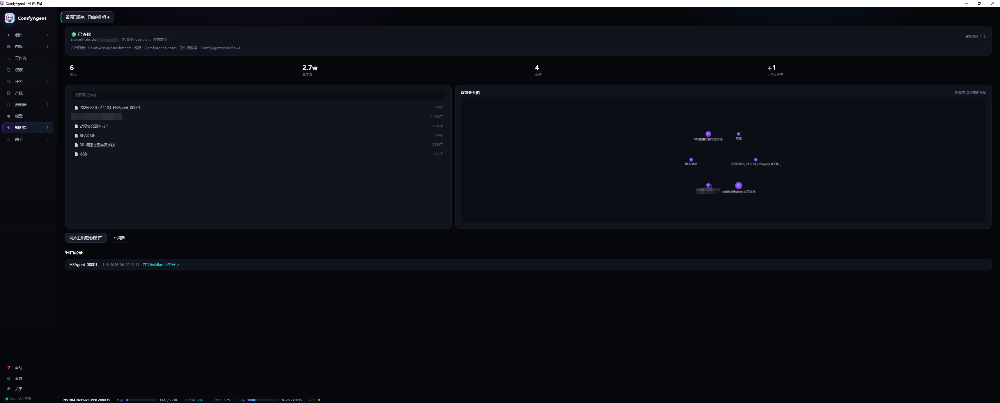
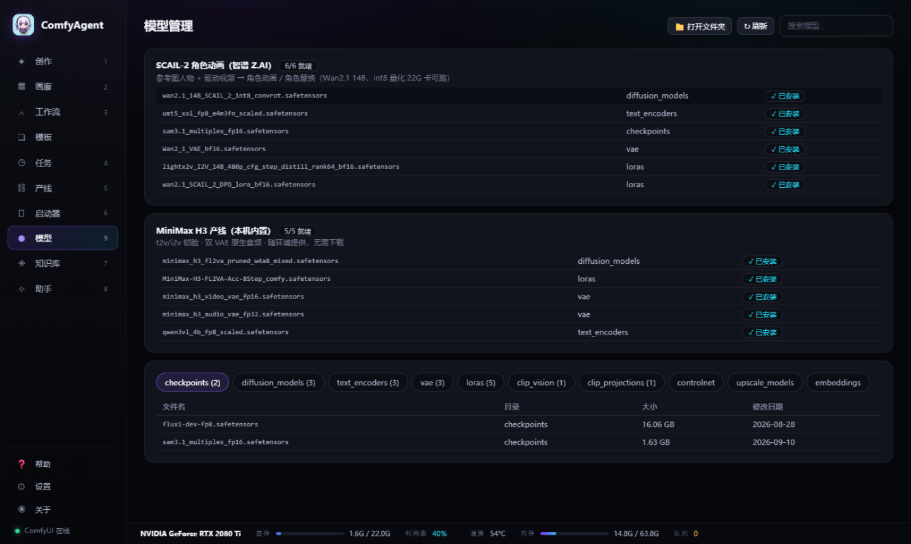
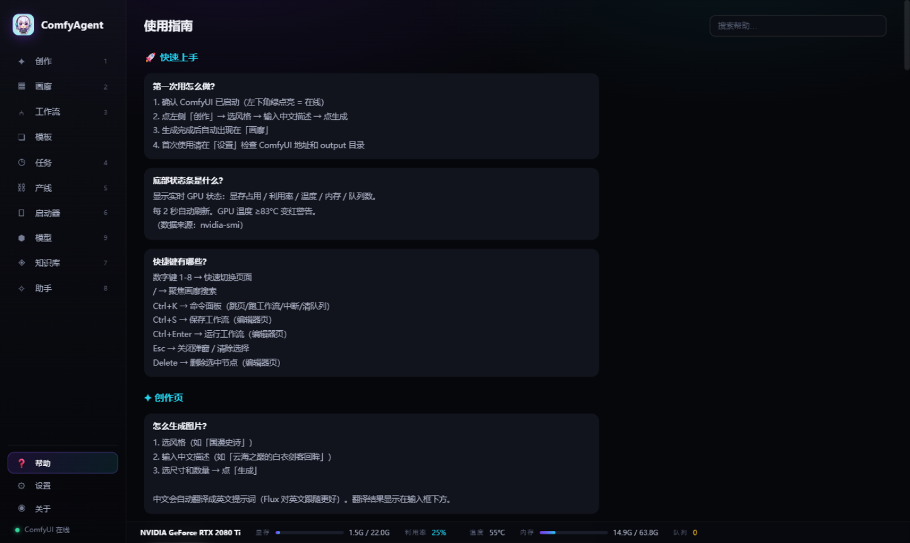
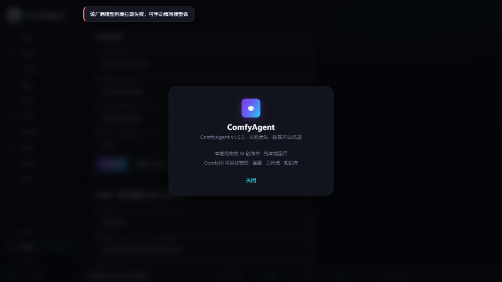

<div align="center">

# ComfyAgent

**A local-first desktop studio for ComfyUI — pure-stdlib Python, vanilla JS, zero dependencies, one 10 MB exe**

[](https://github.com/IvenKooLab/comfy-agent/releases)
[](LICENSE)
[](#quick-start)

English | [简体中文](README_zh-CN.md)

</div>

One native window that runs your local ComfyUI end to end: prompt-to-image/video creation, a gallery, a visual workflow editor, 600+ official templates, a model manager with resumable downloads, batch pipelines for episodic video, and an MCP server so external agents can drive it too.

## Highlights

- 🖥️ **Real desktop app** — double-click the exe: native window + system tray. Closing the window minimizes it; single instance; no console box
- 🔒 **Local-first** — generation runs on your GPU, data never leaves your machine
- 🪶 **Zero dependencies** — pure Python standard library backend + vanilla JS frontend, ~10 MB installed
- 🌐 **Bilingual** — full UI and built-in help in English & Chinese

## Features

- 🎨 **Create** — prompt-to-image (Flux) and prompt-to-video (MiniMax H3, native audio); Chinese prompts are auto-enhanced into English (LLM-powered, dictionary fallback); 12 style presets, character lock strings, image & video modes
- 🖼️ **Gallery** — live masonry, hover video preview, batch archive/delete, PNG parameter parsing, folder filters
- 📚 **Templates** — 600+ official ComfyUI templates with real previews, one-click load into the editor; **new subgraph-based templates (e.g. SCAIL-2 character animation) are auto-flattened** and load like any other
- 🔧 **Workflows** — SVG node editor (drag/link/snap/validation); built-in Flux + H3 workflows; import UI/API JSON or extract from PNG
- 📋 **Runs** — queue, progress, ETA, one-click retry, GPU time ledger
- 🎬 **Pipeline** — episodic script → shot list → batch queue → concat with BGM; shot-to-shot chaining (seamless long takes via last-frame continuation), priority queue, scene library, audio assets, subtitle burn-in, per-episode stats
- ⬢ **Models** — preset suites (SCAIL-2, MiniMax H3) with **one-click resumable downloads** and live progress; browse local model dirs by category with search; opening a template that needs missing models offers a one-jump download
- 🚀 **Launcher** — start/stop/update ComfyUI, model inventory, custom nodes, environment diagnostics (torch/triton/sage), logs
- 🗂️ **Knowledge** — Obsidian archiving, stats, graph view, full-text search
- 🤖 **Assistant** — natural-language control with multi-step actions
- 🔌 **MCP Server** — expose ComfyAgent to any MCP host (see below)
- 📖 **Built-in help** — 50+ searchable Q&A, bilingual
- 📊 **Hardware bar** — GPU util/temp/VRAM/RAM/queue, 2s refresh

## Quick Start

1. Grab `ComfyAgent-win64.zip` from the [latest release](https://github.com/IvenKooLab/comfy-agent/releases/latest) and unzip
2. Double-click `ComfyAgent.exe` — a native window opens (30-second setup wizard on first run)
3. Close to tray; right-click the tray icon to quit

**Requirements:** a local ComfyUI (default `127.0.0.1:8188`); `ffmpeg` on PATH (video poster frames); WebView2 runtime.

To develop against a source checkout: `python server.py --open` (browser mode), `python app.py` (desktop shell), `bash build_exe.sh` (build). See [CHANGELOG.md](CHANGELOG.md) for the design and iteration history.

## Screenshots

**Setup Wizard**



**Create**


**Templates**


**Pipeline**


**Launcher**


**Models**



**Assistant**


**Help**



**Settings**


**About**



## MCP Server

A built-in zero-dependency MCP server (stdio + JSON-RPC 2.0) exposes ComfyAgent to any MCP host (ZCode / Claude Desktop / Cursor, ...):

| Tool | What it does |
|---|---|
| `query_status` | ComfyUI online state, running/queued jobs, VRAM |
| `submit_generation` | Submit image/video generation (auto prompt enhancement, count ≤ 4) |
| `list_workflows` | Workflow library (draft/final tiers with real timings) |
| `search_gallery` | Search local gallery outputs |

```json
"comfyagent": {
  "command": "python",
  "args": ["<repo>/mcp_server.py"],
  "env": { "COMFYAGENT_URL": "http://127.0.0.1:8190" }
}
```

(Requires ComfyAgent to be running.)

## Contributing

Issues and PRs welcome (English or Chinese):

1. Fork → branch → commit → PR
2. Describe the problem you solve and how to verify it
3. Backend changes must stay on the zero-third-party-dependency principle (Python stdlib only)

## License

[MIT](LICENSE) © 2026 IvenKooLab
