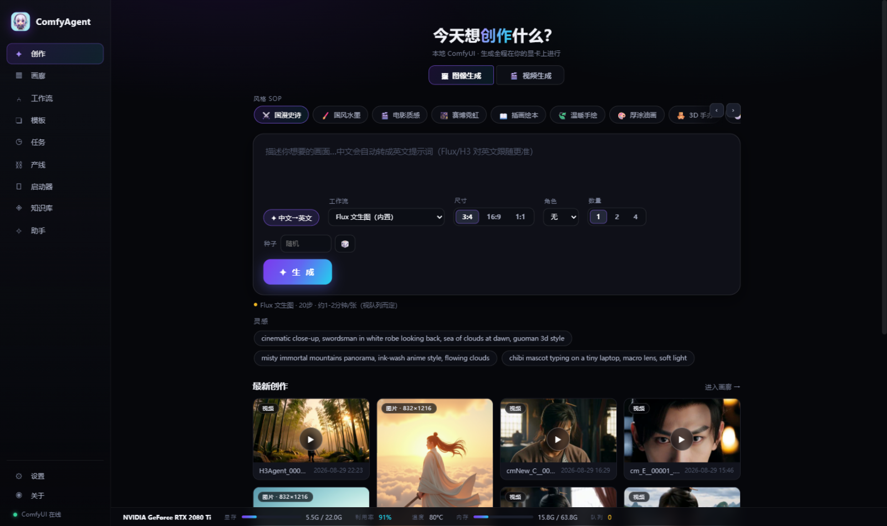
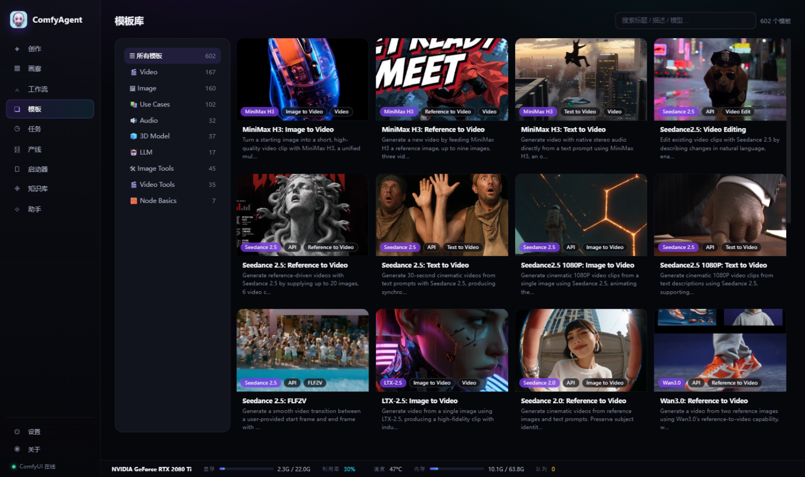

# ComfyAgent · AI Creative Studio

English | [简体中文](README.md)

A local-first AI creative studio: one native window to manage your ComfyUI — Chinese-prompt image/video generation, gallery, visual workflow editor, 600+ template library, task queue, production pipeline, Obsidian knowledge base, and hardware monitoring.





## Why ComfyAgent

- 🖥️ **Desktop app**: double-click the exe = native window + system tray. Closing minimizes to tray, click to restore. Single instance, no console window
- 🔒 **Local-first**: everything renders on your own GPU, data never leaves the machine
- 🪶 **Zero-dependency stack**: pure Python stdlib backend + vanilla JS frontend, ~10 MB distribution
- 🌐 **Bilingual UI**: one-click EN/中文 switching, built-in help translated as well

## Features

- 🎨 **Create**: Chinese prompts auto-enhanced into English (GLM refinement, MyMemory fallback) → Flux images / H3 W4A8 videos (640×352 · 5 s · 4 steps · native audio); 12 style SOPs, 🔒 character lock strings, 🖼️ image & video modes
- 🖼️ **Gallery**: live waterfall, video hover preview, batch archive/delete, PNG metadata parsing, folder filters
- 📚 **Templates**: 602 official ComfyUI templates (9 categories) with real preview images, one-click load into the editor
- 🔧 **Workflow**: SVG node editor (drag-to-connect, grid snapping, node validation); built-in Flux + H3 workflows; import UI/API JSON or extract from PNG
- 📋 **Tasks**: queue, progress, ETA, one-click retry, GPU time ledger
- 🎬 **Production pipeline**: episode script parsing → shot list → batch queue → final cut with BGM mixing; shot keyframe face-lock (i2v), ↳ **shot chaining** (continue from the last frame), ⏫ priority queue, 🌐 scene library, 🎵 audio assets, 💬 subtitle burn-in, 📊 episode aggregation stats
- 🚀 **Launcher**: ComfyUI start/stop, version check & one-click update, model inventory, custom nodes, environment diagnostics (torch · triton · sage detection), logs
- 🗂️ **Knowledge base**: Obsidian archive, stats, backlink graph, full-text search preview
- 🤖 **Assistant**: Chinese commands with multi-step action sequences
- 📖 **Built-in help**: 45+ Q&A covering every module, searchable, bilingual
- 📊 Global **hardware bar**: GPU utilization / temperature / VRAM / RAM / queue (nvidia-smi, 2 s refresh)

## Install

1. Download & unzip `dist/ComfyAgent-win64.zip`
2. Double-click `ComfyAgent.exe` — the native window opens (30-second setup wizard on first run)
3. Closing minimizes to tray; exit from the tray menu

Prerequisites: local ComfyUI (default `127.0.0.1:8188`); ffmpeg on PATH (video poster frames); WebView2 runtime.

## Development

```bash
python server.py --open   # source mode (opens in browser)
python app.py             # desktop shell mode
bash build_exe.sh         # build the product exe
```

Architecture and iteration history: [CHANGELOG.md](CHANGELOG.md).

## Contributing

Issues and PRs welcome (English or Chinese):

1. Fork → branch → commit → open a PR
2. Describe "what problem it solves / how to verify it"
3. Backend changes must keep the zero-third-party-dependency rule (Python stdlib)

## License

[MIT](LICENSE) © 2026 IvenKooLab
